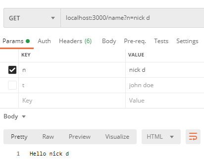
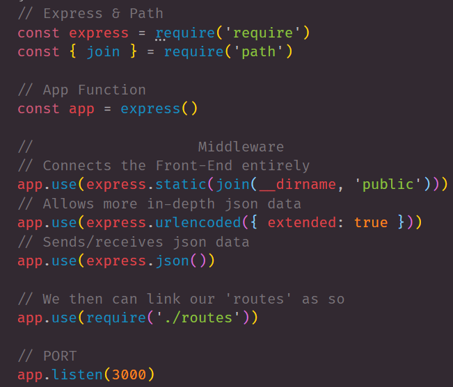

# EXPS002

## About

```
    - We take a deeper dive within Express 
    - We learn what servers can do and their role in web development
    - Comprehensive view on server's being routes
    - Using Restful Routing Syntax
```
## Simple Test: Query vs Params

- Before we introduce the entire boiler plate template lets break it down first
- In these two example's we will cover Query's & Params
- Query's are ID within the Req and Res only
- Params are ID both within the URL and Req/Res

***Examples of a Query***

 ‣ Here is the VS Code


 ‣ Here is the example in Postman



***Example of a Param***


## Server Side Boiler Plate

    ‣ DON"T BOTHER REMEMBERING THIS! 
    ‣ Server-side boiler plate is just like an HTML boiler Plate
    ‣ Certain parts of the boiler plate help you connect F.E. to B.E.

***Sever-Side Boiler Plate***


- Once you have this typed out, you can always refer back to it.
- Feel free to copy and paste from this repo
- server.js in EXPS002 => [EXPS002 GitHub Repo](https://github.com/nicholasd-uci/EXPS002)

***Details Line By Line***




## Source Reference 

- [npm](https://www.npmjs.com/)
- [npm express](https://www.npmjs.com/package/express)
- [express js](https://expressjs.com/)
- [nodemon.io](https://nodemon.io/)

## LINKS

- [GitHub Repo Link](https://github.com/nicholasd-uci/EXPS002)
- [Nicholas Dallas's GitHub](https://github.com/nicholasd-uci)

- - -
© 2020 NPRD, Nicholas Paul Ruiz Dallas